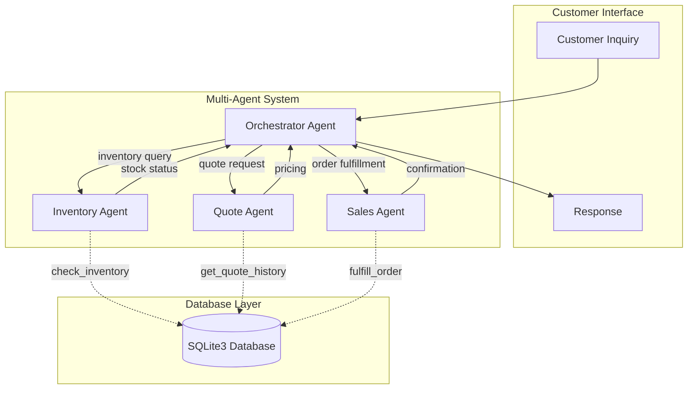

<!--
============================================================================
SYNC IMPACT REPORT
============================================================================
Version Change: 1.2.0 → 1.2.1 (PATCH: Diagramming tool selection)

Modified Sections:
- Technical Constraints: Added "Diagramming: Mermaid (SELECTED)" subsection
- Deliverables Checklist: Updated with Mermaid-specific workflow

Added Sections:
- Diagramming subsection with Mermaid selection rationale and example

Removed Sections: None

Templates Requiring Updates:
- .specify/templates/plan-template.md: ✅ No changes needed (generic template)
- .specify/templates/spec-template.md: ✅ No changes needed (generic template)
- .specify/templates/tasks-template.md: ✅ No changes needed (generic template)
- .specify/templates/checklist-template.md: ✅ No changes needed (generic template)

Follow-up TODOs: None
============================================================================
-->

# Beaver's Choice Paper Company Constitution

## Project Constraints

These principles are **non-negotiable** per the Udacity project assignment requirements.

### I. Agent Economy (5-Agent Maximum)

The multi-agent system MUST contain **at most five (5) agents**. This constraint is
non-negotiable per project requirements.

- Each agent MUST have a clearly defined, non-overlapping responsibility
- Agent delegation patterns MUST be explicit and traceable
- The recommended agent architecture is:
  1. **Orchestrator Agent** - Routes customer inquiries to specialized agents
  2. **Inventory Agent** - Checks stock levels, triggers reorders when necessary
  3. **Quote Agent** - Generates quotes using historical data and bulk discounts
  4. **Sales Agent** - Finalizes transactions based on inventory and delivery timelines
- A fifth agent MAY be added only if a clear, distinct responsibility is identified
- Agent count MUST be verified before any code submission

**Rationale**: Project constraint that also promotes simplicity, clear responsibilities, and
maintainable agent interactions.

### II. Text-Only Interface

All system inputs and outputs MUST be strictly text-based.

- NO graphical user interfaces
- NO binary data processing in agent responses
- Database query results MUST be formatted as text responses
- Agent-to-agent communication MUST use text messages
- Customer inquiries and system responses MUST be human-readable text

**Rationale**: Project constraint ensuring consistent evaluation, clear agent communication,
and simplified testing with the provided sample requests.

### III. Database-Driven Decisions

All business decisions MUST be informed by SQLite3 database queries, not hardcoded logic.

- Inventory decisions (stock levels, reorder points) MUST query current database state
- Quote generation MUST consider historical quote data from the database
- Pricing strategies MUST use stored pricing rules and bulk discount structures
- Transaction records MUST be persisted to the database
- Delivery timeline estimates MUST query supplier data from the database

**Rationale**: Demonstrates effective use of database information as required by project
specifications, ensuring decisions are data-driven and auditable.

### IV. Tool-Agent Architecture

Specialized agents MUST interact with the system through well-defined tools.

Required tools (wrapping project_starter.py helper functions):
- `check_inventory(paper_type)` - Query inventory for specific paper types
- `get_quote_history(customer_request)` - Retrieve historical quote data for pricing
- `check_delivery_timeline(item)` - Get supplier delivery estimates
- `fulfill_order(order_details)` - Update database for completed orders

Tool implementation requirements:
- Tool outputs MUST be deterministic given the same database state
- Tools MUST handle edge cases (out of stock, unknown paper type, etc.)
- Tool errors MUST return informative text messages
- Tools MUST NOT bypass the database layer

**Rationale**: Clean separation of concerns between agent logic and system operations,
enabling testable components and clear responsibility boundaries.

### V. Single-File Deliverable

All multi-agent system code MUST reside in a single Python file: `beaver_agents.py`.

- External dependencies limited to: `smolagents` framework and `sqlite3`
- Database initialization MAY reference project_starter.py utilities
- Configuration MUST be embedded or minimal (no external config files required)
- The file MUST be self-contained and runnable with: `python beaver_agents.py`

**Rationale**: Project submission requirement ensuring easy evaluation and portability.

## Development Principles

These principles ensure code quality and maintainability for a training submission.

### VI. Simplicity First (KISS)

Every implementation decision MUST favor the simplest solution that meets requirements.

- **Single Responsibility**: Each function and class MUST do one thing well
- **Minimal Abstraction**: Do NOT create abstractions until a pattern repeats 3+ times
- **Direct Solutions**: Prefer straightforward code over clever optimizations
- **Flat Structures**: Avoid deep nesting—max 2 levels of directory depth for source code
- **No Premature Optimization**: Write clear code first; optimize only when measured

**Rationale**: This is a training exercise for submission. Reviewers MUST be able to understand
the codebase quickly. Complexity obscures learning and introduces maintenance burden.

### VII. No Repetition (DRY)

Shared logic MUST be extracted only when it reduces maintenance burden.

- **Rule of Three**: Extract common code only after 3+ occurrences
- **Colocate Related Code**: Keep related functionality close rather than scattered
- **Explicit Over Implicit**: Prefer some duplication over unclear abstractions
- **Configuration Over Code**: Use config files for values that change between environments

**Rationale**: DRY reduces bugs from inconsistent updates, but premature abstraction creates
cognitive overhead. The threshold of 3 ensures extractions are genuinely valuable.

### VIII. Human Readability

All code MUST be immediately understandable by a human reviewer.

- **Descriptive Naming**: Variables, functions, and files MUST have self-documenting names
- **Consistent Formatting**: Follow PEP 8 style guide for all Python code
- **Logical File Organization**: Group files by feature or domain, not by type
- **Inline Comments**: Add comments only where the "why" is not obvious from the code
- **Clear Agent Prompts**: System prompts for agents MUST be well-structured and documented

**Rationale**: Code is read 10x more than it is written. For a training submission,
reviewers will evaluate based on how quickly they can understand the implementation.

### IX. Security First

Secrets and credentials MUST NEVER be committed to version control.

- **Environment Variables**: All API keys MUST be loaded from `.env` files
- **Gitignore**: `.env` files MUST be listed in `.gitignore`
- **No Hardcoded Secrets**: NEVER hardcode API keys, passwords, or tokens in code
- **Validation**: Assert that required environment variables exist before runtime

**Rationale**: Protecting API keys and credentials is a fundamental security practice.
Exposing secrets in a public repository creates security vulnerabilities and may violate
terms of service for API providers.

## Technical Constraints

### Framework: smolagents (SELECTED)

**Decision**: `smolagents` (HuggingFace) is the SELECTED framework for this project.

**Selection Rationale**:
- Philosophy alignment: "The best agentic systems are the simplest" matches KISS principle
- `ManagedAgent` pattern directly supports Orchestrator → Specialist architecture
- `@tool` decorator provides clean, minimal tool definitions
- Best documentation quality for 6-hour implementation timeline
- Highly readable code for reviewer evaluation

**Rejected Alternatives**:
- `pydantic-ai` - More boilerplate, overkill for project scope
- `npcpy` - Less documentation, "NPC" terminology may confuse reviewers

### Agent Architecture (smolagents)

```
Orchestrator (CodeAgent with managed_agents)
├── inventory_agent (ToolCallingAgent) → check_inventory, trigger_reorder
├── quote_agent (ToolCallingAgent) → get_quote_history, calculate_quote
└── sales_agent (ToolCallingAgent) → check_delivery_timeline, fulfill_order
```

**Implementation Pattern**:
```python
from smolagents import tool, CodeAgent, ToolCallingAgent

@tool
def check_inventory(paper_type: str) -> str:
    """Query inventory for a specific paper type.

    Args:
        paper_type: Type of paper (e.g., 'Letter', 'Legal', 'Cardstock')
    """
    # SQLite3 query logic here
    return formatted_result

# Specialist agents use ToolCallingAgent
inventory_agent = ToolCallingAgent(
    tools=[check_inventory],
    model=model,
    name="inventory_agent",
    description="Checks stock levels and manages reorder decisions"
)

# Orchestrator uses CodeAgent with managed_agents
orchestrator = CodeAgent(
    tools=[],
    model=model,
    managed_agents=[inventory_agent, quote_agent, sales_agent]
)
```

### Database: SQLite3

Schema managed by project_starter.py:
- Inventory stock levels
- Financial transactions
- Quote history
- Supplier delivery estimates
- Cash balance tracking

### Language: Python 3.x

### Scope Boundaries

- NO external API calls (system is self-contained)
- NO network requests beyond LLM API (required by smolagents)
- NO file I/O beyond database and CSV test files

### Business Logic Requirements

- Quote pricing MUST consider historical data AND bulk discounts
- Inventory reordering MUST be autonomous when stock falls below thresholds
- Sales transactions MUST verify inventory availability before fulfillment

### Diagramming: Mermaid (SELECTED)

**Decision**: Mermaid is the SELECTED diagramming tool for the workflow diagram deliverable.

**Selection Rationale**:
- **Text-based source** - Aligns with Text-Only Interface principle; diagram is code
- **Version controllable** - Mermaid source trackable in git (unlike binary .drawio files)
- **KISS alignment** - Simple declarative syntax, no GUI tool required
- **Embeddable** - Can include in README.md or documentation files
- **GitHub native** - Renders automatically in markdown files

**Rejected Alternative**:
- `Diagrams.net` - Binary files, requires separate GUI, harder to track changes

**Workflow Diagram Template**:


**Deliverable Workflow**:
1. Store Mermaid source in `docs/workflow.md` or `README.md`
2. Export to PNG using: `mmdc -i workflow.md -o workflow.png` (mermaid-cli)
3. Alternative: Use GitHub's renderer or https://mermaid.live for export
4. Submit the exported PNG as the required "image file"

## Evaluation Criteria

The system will be evaluated against these criteria (per project rubric):

1. **Inquiry Handling**: Agents correctly handle various customer inquiries and orders
2. **Inventory Optimization**: Orders are accommodated to optimize inventory use and
   profitability
3. **Competitive Pricing**: Quoting agent provides competitive and attractive pricing

**Test Artifacts**:
- Input: `quote_requests_sample.csv` - Test dataset for validation
- Output: `test_results.csv` - Evaluation results documentation

**Deliverables Checklist**:
- [ ] Workflow diagram (`workflow.png`) - Mermaid source → exported PNG
- [ ] Mermaid source (`docs/workflow.md` or in README.md) - Version-controlled diagram code
- [ ] Source code (`beaver_agents.py`) - Single Python file
- [ ] Documentation explaining system design and requirement verification

## Governance

This constitution establishes non-negotiable rules for the Beaver's Choice Paper Company
multi-agent system project.

**Authority**: Constitution supersedes all other development decisions and practices.

**Compliance Verification**:
- All code MUST verify agent count does not exceed 5
- All code MUST ensure text-only I/O constraint
- All database operations MUST be traceable to tool invocations
- Single-file constraint MUST be maintained throughout development
- Code MUST follow KISS, DRY, and readability principles
- NO secrets committed to version control
- Framework MUST be smolagents (no substitutions)

**Amendment Procedure**:
1. Proposed changes MUST be documented with rationale
2. Changes affecting core principles require explicit justification
3. Version number MUST be incremented per semantic versioning
4. Last Amended date MUST be updated

**Versioning Policy**:
- MAJOR: Backward-incompatible principle changes or removals
- MINOR: New sections added or principle expansions
- PATCH: Clarifications, wording fixes, non-semantic changes

**Version**: 1.2.1 | **Ratified**: 2026-01-06 | **Last Amended**: 2026-01-06
