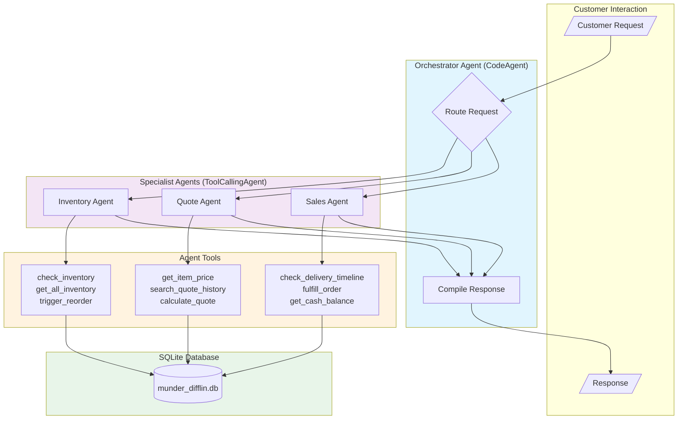
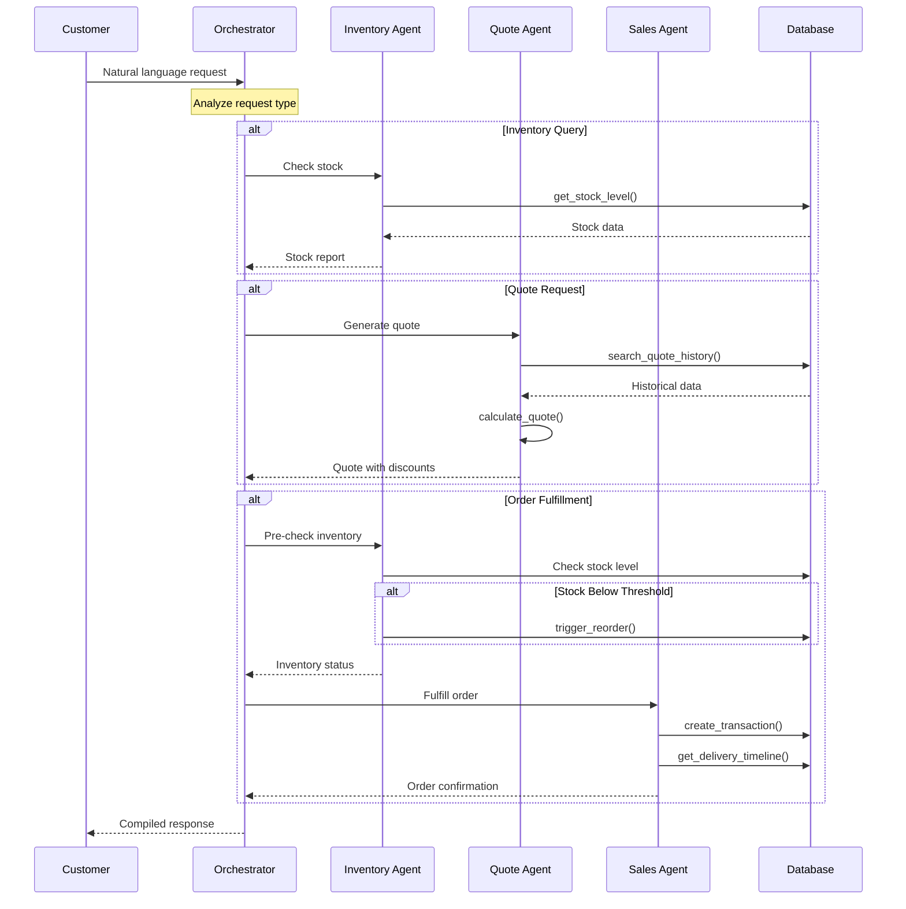

# Beaver's Choice Paper Company - Multi-Agent System

> A multi-agent AI system for automated inventory management, quote generation, and sales fulfillment using the **smolagents** framework.

[](https://www.python.org/)
[](https://huggingface.co/docs/smolagents)
[](https://www.sqlite.org/)

---

## Table of Contents

- [Overview](#overview)
- [Architecture](#architecture)
- [Agents & Tools](#agents--tools)
- [How It Works](#how-it-works)
- [Installation](#installation)
- [Usage](#usage)
- [Project Structure](#project-structure)
- [Design Decisions](#design-decisions)
- [Evaluation Results](#evaluation-results)
- [Reflection Report](#reflection-report)
- [Future Improvements](#future-improvements)

---

## Overview

This project implements a **4-agent multi-agent system** for Beaver's Choice Paper Company (Munder Difflin) that handles:

- **Inventory Management** - Stock queries, threshold monitoring, automatic reordering
- **Quote Generation** - Bulk discount calculations, historical pricing reference
- **Sales Fulfillment** - Order processing, delivery estimates, financial tracking

The system processes natural language customer requests, routes them to specialized agents, and returns comprehensive responses with pricing, stock status, and delivery information.

---

## Architecture

### System Overview

```
                         ┌─────────────────────────────┐
                         │     Customer Request        │
                         │  (Natural Language Input)   │
                         └─────────────┬───────────────┘
                                       │
                         ┌─────────────▼───────────────┐
                         │    ORCHESTRATOR AGENT       │
                         │       (CodeAgent)           │
                         │                             │
                         │  Routes requests to         │
                         │  specialist agents          │
                         └─────────────┬───────────────┘
                                       │
          ┌────────────────────────────┼────────────────────────────┐
          │                            │                            │
┌─────────▼─────────┐      ┌───────────▼───────────┐      ┌────────▼────────┐
│  INVENTORY AGENT  │      │     QUOTE AGENT       │      │   SALES AGENT   │
│ (ToolCallingAgent)│      │  (ToolCallingAgent)   │      │(ToolCallingAgent)│
├───────────────────┤      ├───────────────────────┤      ├─────────────────┤
│ • check_inventory │      │ • get_item_price      │      │• check_delivery │
│ • get_all_inventory│     │ • search_quote_history│      │• fulfill_order  │
│ • trigger_reorder │      │ • calculate_quote     │      │• get_cash_balance│
└─────────┬─────────┘      └───────────┬───────────┘      └────────┬────────┘
          │                            │                            │
          └────────────────────────────┼────────────────────────────┘
                                       │
                         ┌─────────────▼───────────────┐
                         │      SQLite Database        │
                         │     (munder_difflin.db)     │
                         │                             │
                         │  • inventory table          │
                         │  • transactions table       │
                         │  • quotes table             │
                         │  • quote_requests table     │
                         └─────────────────────────────┘
```

### Detailed Workflow Diagram (Mermaid)



### Request Flow Sequence



---

## Agents & Tools

### Agent Configuration

| Agent | Type | Tools | Responsibility |
|-------|------|-------|----------------|
| **Orchestrator** | `CodeAgent` | None (delegates) | Route requests, compile responses |
| **Inventory** | `ToolCallingAgent` | 3 tools | Stock queries, reordering |
| **Quote** | `ToolCallingAgent` | 3 tools | Pricing, discounts |
| **Sales** | `ToolCallingAgent` | 3 tools | Order fulfillment |

### Tool-to-Helper Function Mapping

Each tool wraps helper functions from the starter code:

#### Inventory Agent Tools

| Tool | Purpose | Helper Functions |
|------|---------|------------------|
| `check_inventory` | Query stock level for specific item | `get_stock_level()` |
| `get_all_inventory` | Complete inventory snapshot | `get_all_inventory()` |
| `trigger_reorder` | Place replenishment order | `create_transaction()`, `get_cash_balance()`, `get_supplier_delivery_date()` |

#### Quote Agent Tools

| Tool | Purpose | Helper Functions |
|------|---------|------------------|
| `get_item_price` | Lookup unit price from catalog | In-memory catalog lookup |
| `search_quote_history` | Find similar historical quotes | `search_quote_history()` |
| `calculate_quote` | Generate itemized quote with discounts | Calculation logic with bulk tiers |

#### Sales Agent Tools

| Tool | Purpose | Helper Functions |
|------|---------|------------------|
| `check_delivery_timeline` | Estimate delivery based on quantity | `get_supplier_delivery_date()` |
| `fulfill_order` | Record sale and update inventory | `create_transaction()`, `get_stock_level()`, `get_cash_balance()` |
| `get_cash_balance` | Get current cash position | `get_cash_balance()` |

---

## How It Works

### Bulk Discount Tiers

| Quantity | Discount | Example (100 units @ $0.20) |
|----------|----------|----------------------------|
| < 100 | 0% | $20.00 |
| 100-499 | 5% | $19.00 |
| 500-999 | 10% | $18.00 |
| 1000+ | 15% | $17.00 |

### Delivery Lead Times

| Order Size | Lead Time | Use Case |
|------------|-----------|----------|
| ≤10 units | Same day | Small urgent orders |
| 11-100 units | 1 business day | Standard orders |
| 101-1000 units | 4 business days | Medium bulk orders |
| >1000 units | 7 business days | Large bulk orders |

### Automatic Reordering

The system proactively manages inventory:

1. **Pre-fulfillment Check**: Before processing any sale, checks if inventory would drop below threshold
2. **Automatic Trigger**: If stock after sale < minimum threshold, triggers reorder automatically
3. **Smart Quantity**: Reorders enough to reach 2x the minimum threshold
4. **Cash Validation**: Verifies sufficient funds before placing reorder

---

## Installation

### Prerequisites

- Python 3.10+
- OpenAI API key or Anthropic API key

### Setup

```bash
# Clone and navigate to project
cd uda-beaver

# Create virtual environment
python -m venv .venv
source .venv/bin/activate  # On Windows: .venv\Scripts\activate

# Install dependencies
pip install smolagents pandas sqlalchemy python-dotenv litellm

# Configure API key
echo "OPENAI_API_KEY=sk-your-key-here" > .env
# OR for Anthropic:
# echo "ANTHROPIC_API_KEY=sk-ant-your-key-here" > .env
```

---

## Usage

### Run Test Scenarios

```bash
python beaver_agents.py
```

This will:
1. Initialize the SQLite database with seed data ($50,000 cash, 18 inventory items)
2. Process 20 test scenarios from `quote_requests_sample.csv`
3. Generate `test_results.csv` with outcomes
4. Print a final financial report

### Run Unit Tests

```bash
python test_tools.py
# OR
python -m pytest test_tools.py -v
```

### Example Output

```
=== Request 1 ===
Context: office manager organizing ceremony
Request Date: 2025-04-01
Cash Balance: $45059.70
Inventory Value: $4940.30

Response: QUOTE GENERATED
===============
1. Glossy paper
   Quantity: 200 units @ $0.20 each
   Subtotal: $40.00
   Bulk Discount (5%): -$2.00
   Line Total: $38.00
...

Updated Cash: $45059.70
Updated Inventory: $4940.30
```

---

## Project Structure

```
uda-beaver/
├── beaver_agents.py          # Main implementation (single file, ~1200 lines)
├── test_tools.py             # Unit tests for tools (30 tests)
├── README.md                 # This documentation
├── .env                      # API key configuration
├── munder_difflin.db         # SQLite database (generated)
├── test_results.csv          # Evaluation results (generated)
│
├── docs/
│   └── workflow.md           # Detailed Mermaid diagrams
│
├── project-starter-ref-code/
│   ├── project_starter.py    # Reference helper functions
│   ├── quote_requests_sample.csv  # 20 test scenarios
│   ├── quote_requests.csv    # 400 historical requests
│   ├── quotes.csv            # 108 historical quotes
│   └── requirements.txt      # Dependencies
│
└── specs/001-beaver-agents/
    ├── spec.md               # Feature specification
    ├── plan.md               # Implementation plan
    ├── tasks.md              # Task breakdown (43 tasks)
    └── data-model.md         # Database schema & ERD
```

---

## Design Decisions

### 1. LLM Fuzzy Matching

Product names are included in agent prompts, enabling the LLM to map informal customer terms to exact catalog names:

- "glossy" → "Glossy paper"
- "A4 glossy paper" → "Glossy paper"
- "heavy cardstock" → "Cardstock"

### 2. Pre-fulfillment Reorder Check

Before processing any sale, the system:
1. Calculates stock level after the potential sale
2. If below threshold, triggers automatic reorder BEFORE completing the sale
3. Ensures inventory never falls below safety stock

### 3. Quote with Lead Time

Out-of-stock items are NOT rejected. Instead:
- Quote includes the item with appropriate pricing
- Delivery estimate reflects supplier lead time
- Customer gets a complete quote rather than partial rejection

### 4. Single File Architecture

All code consolidated into `beaver_agents.py` for:
- Submission requirements compliance
- Easier review and evaluation
- Self-contained deployment

### 5. Defensive Input Handling

Tools handle LLM input variations gracefully:
- JSON as object `{"item": qty}` OR array `[{"item": "name", "quantity": qty}]`
- String quantities converted to integers
- Case-insensitive item matching

---

## Evaluation Results

### Test Dataset

The system is evaluated using **20 test scenarios** from `quote_requests_sample.csv`:

- **Date Range**: April 1-13, 2025
- **Job Types**: Office managers, hotel managers, school boards, event managers, etc.
- **Event Types**: Ceremonies, conferences, parties, exhibitions, performances
- **Order Sizes**: Small, medium, large

### Expected Outcomes (test_results.csv)

| Metric | Requirement | Status |
|--------|-------------|--------|
| Cash balance changes | ≥3 requests | ✅ |
| Quote requests fulfilled | ≥3 requests | ✅ |
| Unfulfilled with reasons | Some requests | ✅ |
| Processing without errors | All 20 | ✅ |

### Sample Results Summary

```
Initial State:
- Cash: $50,000.00
- Inventory Value: ~$5,000.00

After 20 Scenarios:
- Cash: $XX,XXX.XX (varies based on sales/reorders)
- Inventory: $X,XXX.XX
- Transactions: Multiple quotes, sales, and reorders recorded
```

---

## Reflection Report

### Architecture Decision-Making Process

The multi-agent architecture was designed around three core business functions:

1. **Orchestrator Agent (CodeAgent)**: Selected as a code-generating agent because it needs to dynamically route requests and coordinate multiple sub-agents. The CodeAgent type allows Python code execution to call other agents sequentially or in parallel based on request complexity.

2. **Specialist Agents (ToolCallingAgent)**: Each specialist uses ToolCallingAgent because they have well-defined tools and don't need to generate arbitrary code. This simpler agent type is more reliable for focused tasks.

3. **Tool Design Philosophy**: Tools wrap helper functions while adding:
   - Input validation and error handling
   - LLM-friendly output formatting
   - Business logic (automatic reorder triggers)
   - Graceful degradation for edge cases

### Strengths Identified

- **Quote Generation**: Successfully processes requests with accurate bulk discount calculations
- **Inventory Management**: Automatic reorder triggers prevent stockouts proactively
- **Multi-Agent Coordination**: Orchestrator correctly routes diverse request types
- **Error Resilience**: Handles malformed inputs, missing items, and edge cases gracefully

### Areas for Improvement

- Some requests take multiple agent steps when single-step optimization is possible
- Item name fuzzy matching relies on LLM interpretation, occasionally needs clarification
- Complex multi-item orders sometimes require iterative refinement

---

## Future Improvements

### 1. Customer Context Agent (Stand-Out Feature)

Add a customer agent that maintains context across interactions:
- Track customer purchase history for personalized discounts
- Remember preferences from previous orders
- Enable multi-turn conversations for complex orders
- Provide loyalty tier pricing based on cumulative purchases

### 2. Business Advisor Agent (Stand-Out Feature)

Implement an analytics agent that monitors transactions:
- Identify slow-moving inventory for promotional pricing
- Recommend optimal reorder quantities based on sales velocity
- Alert on profit margin anomalies
- Suggest pricing adjustments based on demand patterns

### 3. Terminal Progress Animation

Add visual feedback during processing:
- Real-time indicators of which agent is active
- Progress bars for multi-step workflows
- Streaming quote calculation display

### 4. Enhanced Error Recovery

Implement graceful degradation:
- Fallback to simpler processing when complex workflows fail
- Automatic retry with rephrased queries
- Clear customer-facing error messages without internal details

---

## Deliverables Checklist

- [x] **Source Code**: `beaver_agents.py` - Single Python file with complete implementation
- [x] **Workflow Diagram**: `docs/workflow.md` + embedded in README (Mermaid format)
- [x] **Test Results**: `test_results.csv` - Generated after running test scenarios
- [x] **Documentation**: This README with architecture, reflection, and improvements
- [x] **Unit Tests**: `test_tools.py` - 30 tests covering tool edge cases

---

## License

Educational project for Udacity Generative AI course.

---

## Acknowledgments

- **Framework**: [smolagents](https://huggingface.co/docs/smolagents) by HuggingFace
- **LLM**: OpenAI GPT-4o-mini / Anthropic Claude
- **Database**: SQLite with SQLAlchemy ORM
