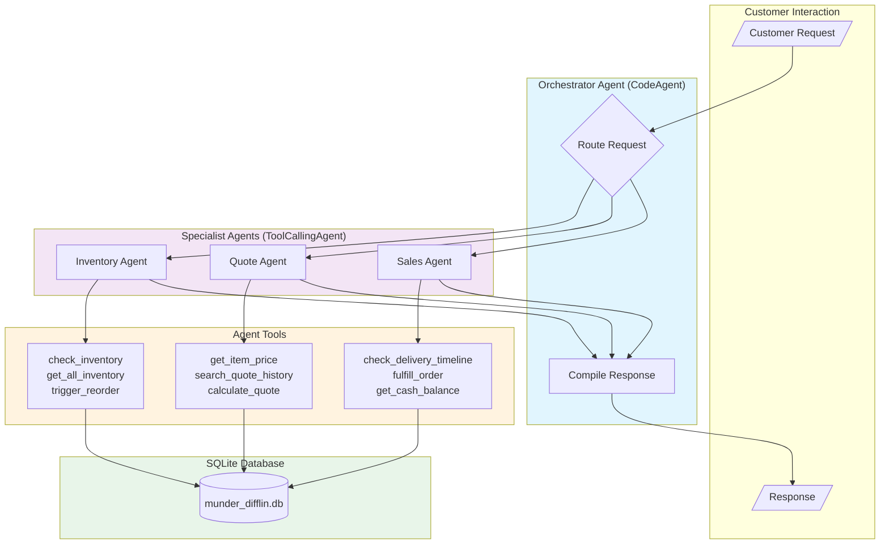
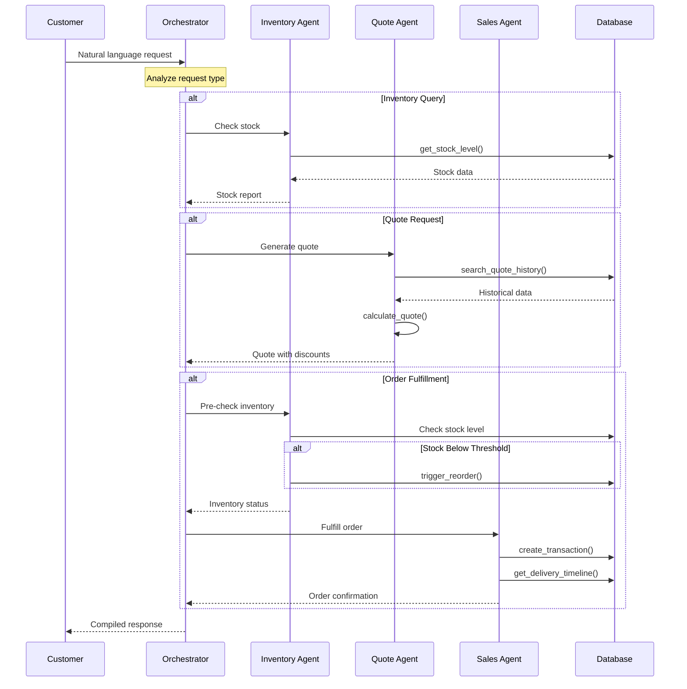
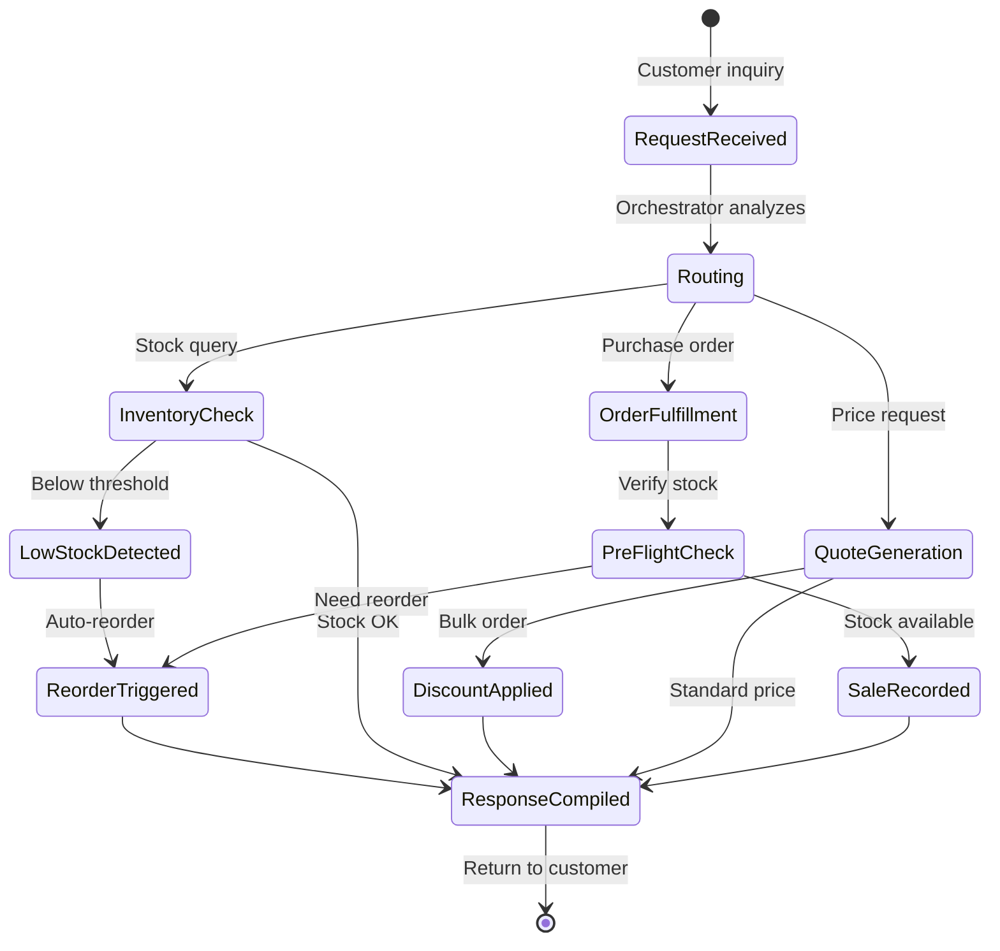

# Beaver's Choice Paper Company - Agent Workflow

## Multi-Agent Architecture

## Request Flow Sequence

## State Transitions

## Agent Configuration

| Agent | Type | Tools | Responsibility |
|-------|------|-------|----------------|
| Orchestrator | `CodeAgent` | None (delegates) | Route requests, compile responses |
| Inventory | `ToolCallingAgent` | 3 tools | Stock queries, reordering |
| Quote | `ToolCallingAgent` | 3 tools | Pricing, discounts |
| Sales | `ToolCallingAgent` | 3 tools | Order fulfillment |

## Tool-to-Helper Function Mapping

Each tool uses specific helper functions from the starter code (`project_starter.py`):

### Inventory Agent Tools

| Tool | Purpose | Helper Functions Used |
|------|---------|----------------------|
| `check_inventory` | Query stock level for a specific item | `get_stock_level()` |
| `get_all_inventory` | Get complete inventory snapshot | `get_all_inventory()` |
| `trigger_reorder` | Place replenishment order | `create_transaction()`, `get_cash_balance()`, `get_supplier_delivery_date()` |

### Quote Agent Tools

| Tool | Purpose | Helper Functions Used |
|------|---------|----------------------|
| `get_item_price` | Lookup unit price from catalog | None (uses in-memory catalog) |
| `search_quote_history` | Find similar historical quotes | `search_quote_history()` |
| `calculate_quote` | Generate itemized quote with discounts | None (calculation logic only) |

### Sales Agent Tools

| Tool | Purpose | Helper Functions Used |
|------|---------|----------------------|
| `check_delivery_timeline` | Estimate delivery based on quantity | `get_supplier_delivery_date()` |
| `fulfill_order` | Record sale and update inventory | `create_transaction()`, `get_stock_level()`, `get_cash_balance()`, `get_supplier_delivery_date()` |
| `get_cash_balance` | Get current cash position | `get_cash_balance()` |

### Test Harness Functions

| Function | Purpose | Helper Functions Used |
|----------|---------|----------------------|
| `run_test_scenarios()` | Process test dataset | `init_database()`, `generate_financial_report()` |

## Bulk Discount Tiers

| Quantity | Discount |
|----------|----------|
| < 100 | 0% |
| 100-499 | 5% |
| 500-999 | 10% |
| 1000+ | 15% |

## Delivery Lead Times

| Quantity | Lead Time |
|----------|-----------|
| ≤10 | Same day |
| 11-100 | 1 day |
| 101-1000 | 4 days |
| >1000 | 7 days |
