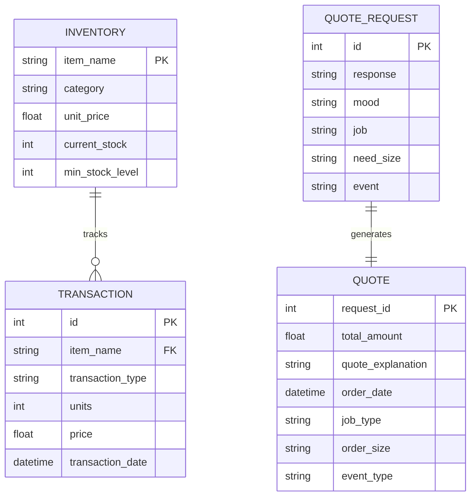
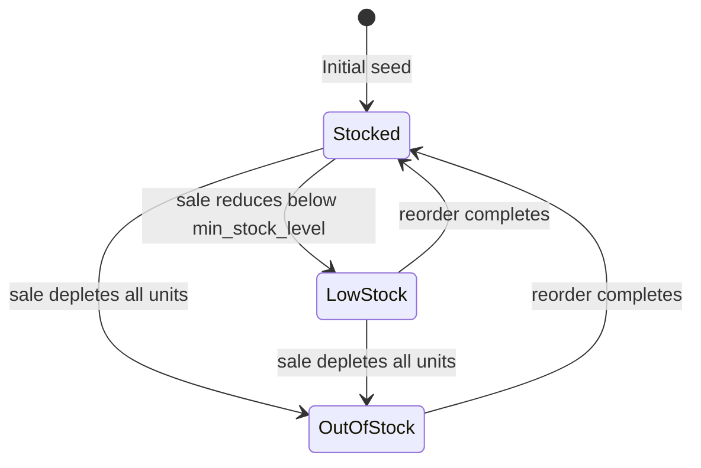
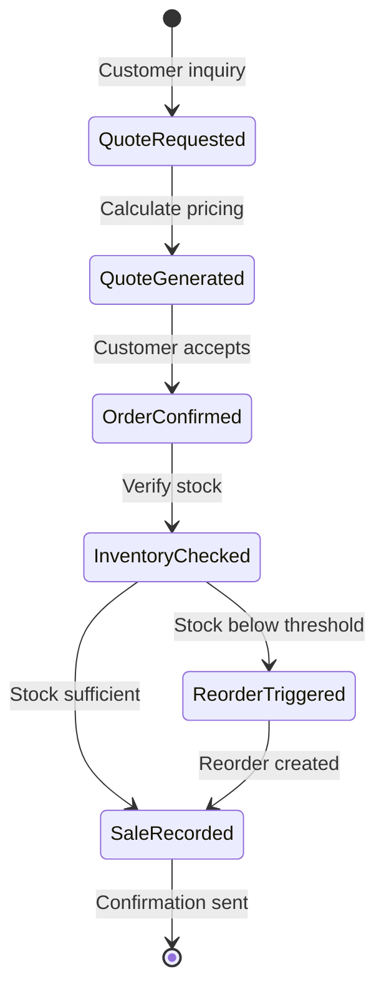

# Data Model: Beaver's Choice Paper Company

**Phase**: 1 - Design
**Date**: 2026-01-06
**Source**: `project_starter.py` schema analysis

## Entity Relationship Diagram

---

## Entity Definitions

### Inventory Item

Represents a product in the paper supply catalog.

| Field | Type | Description | Constraints |
|-------|------|-------------|-------------|
| `item_name` | string | Product name (primary key) | Unique, not null |
| `category` | string | Product category | One of: paper, product, large_format, specialty |
| `unit_price` | float | Price per unit | > 0 |
| `current_stock` | int | Current stock level | >= 0, calculated from transactions |
| `min_stock_level` | int | Reorder threshold | > 0 |

**Notes**:
- `current_stock` is computed dynamically from transactions (SUM of stock_orders - SUM of sales)
- Initial inventory covers ~40% of 44 total product types
- Stock ranges from 200-800 units initially

**Categories**:
- `paper`: Basic paper types (A4, Letter, Cardstock, etc.)
- `product`: Paper products (plates, cups, napkins, etc.)
- `large_format`: Posters, banners
- `specialty`: Premium paper stocks (100lb cover, 250gsm, etc.)

---

### Transaction

Records all inventory movements (incoming stock orders, outgoing sales).

| Field | Type | Description | Constraints |
|-------|------|-------------|-------------|
| `id` | int | Auto-increment ID | Primary key |
| `item_name` | string | Product reference | Nullable (for cash-only entries) |
| `transaction_type` | string | Type of movement | One of: stock_orders, sales |
| `units` | int | Quantity | Nullable, > 0 when present |
| `price` | float | Total transaction value | >= 0 |
| `transaction_date` | datetime | When transaction occurred | ISO format |

**Transaction Types**:
- `stock_orders`: Incoming inventory (cost deducted from cash)
- `sales`: Outgoing inventory (revenue added to cash)

**Business Rules**:
- Cash balance = SUM(sales.price) - SUM(stock_orders.price)
- Inventory level = SUM(stock_orders.units) - SUM(sales.units) per item
- Initial $50,000 cash seeded as a sales transaction with null item_name

---

### Quote Request

Incoming customer inquiries for paper supplies.

| Field | Type | Description | Constraints |
|-------|------|-------------|-------------|
| `id` | int | Auto-increment ID | Primary key |
| `response` | string | Customer's request text | Not null |
| `mood` | string | Customer sentiment | Optional |
| `job` | string | Customer's job role | e.g., "office manager", "school teacher" |
| `need_size` | string | Order size category | One of: small, medium, large |
| `event` | string | Event type | e.g., "conference", "party", "ceremony" |

**Source**: Loaded from `quote_requests.csv` during database initialization

---

### Quote

Historical pricing proposals generated for customer requests.

| Field | Type | Description | Constraints |
|-------|------|-------------|-------------|
| `request_id` | int | Link to quote request | Foreign key to QUOTE_REQUEST.id |
| `total_amount` | float | Quoted price | >= 0, -1 indicates error |
| `quote_explanation` | string | Pricing breakdown | Includes discount justification |
| `order_date` | datetime | When quote was generated | ISO format |
| `job_type` | string | Customer job category | Extracted from request metadata |
| `order_size` | string | Order size category | One of: small, medium, large |
| `event_type` | string | Event category | Extracted from request metadata |

**Source**: Loaded from `quotes.csv` during database initialization

**Notes**:
- `total_amount = -1` indicates a parsing error in historical data
- `quote_explanation` contains detailed breakdown used for competitive analysis

---

## State Transitions

### Inventory Level State Machine

### Order Processing Flow

---

## Validation Rules

### Inventory Validation

1. **Item Name**: Must exist in `paper_supplies` catalog
2. **Unit Price**: Must be > 0
3. **Current Stock**: Calculated field, never directly modified
4. **Min Stock Level**: Must be between 50-150 (per seed logic)

### Transaction Validation

1. **Transaction Type**: Must be exactly "stock_orders" or "sales"
2. **Units**: Must be positive integer when item_name is present
3. **Price**: Must be >= 0
4. **Date**: Must be valid ISO datetime format

### Quote Validation

1. **Total Amount**: Must be >= 0 (or -1 for errors)
2. **Explanation**: Must include pricing breakdown
3. **Request ID**: Must reference valid quote request

---

## Product Catalog Reference

The complete catalog of 44 products with pricing:

### Paper Types (25 items)
| Item | Unit Price |
|------|------------|
| A4 paper | $0.05 |
| Letter-sized paper | $0.06 |
| Cardstock | $0.15 |
| Colored paper | $0.10 |
| Glossy paper | $0.20 |
| Matte paper | $0.18 |
| Recycled paper | $0.08 |
| Eco-friendly paper | $0.12 |
| Poster paper | $0.25 |
| Banner paper | $0.30 |
| Kraft paper | $0.10 |
| Construction paper | $0.07 |
| Wrapping paper | $0.15 |
| Glitter paper | $0.22 |
| Decorative paper | $0.18 |
| Letterhead paper | $0.12 |
| Legal-size paper | $0.08 |
| Crepe paper | $0.05 |
| Photo paper | $0.25 |
| Uncoated paper | $0.06 |
| Butcher paper | $0.10 |
| Heavyweight paper | $0.20 |
| Standard copy paper | $0.04 |
| Bright-colored paper | $0.12 |
| Patterned paper | $0.15 |

### Product Types (15 items)
| Item | Unit Price |
|------|------------|
| Paper plates | $0.10 |
| Paper cups | $0.08 |
| Paper napkins | $0.02 |
| Disposable cups | $0.10 |
| Table covers | $1.50 |
| Envelopes | $0.05 |
| Sticky notes | $0.03 |
| Notepads | $2.00 |
| Invitation cards | $0.50 |
| Flyers | $0.15 |
| Party streamers | $0.05 |
| Decorative adhesive tape (washi tape) | $0.20 |
| Paper party bags | $0.25 |
| Name tags with lanyards | $0.75 |
| Presentation folders | $0.50 |

### Large Format (2 items)
| Item | Unit Price |
|------|------------|
| Large poster paper (24x36 inches) | $1.00 |
| Rolls of banner paper (36-inch width) | $2.50 |

### Specialty (4 items)
| Item | Unit Price |
|------|------------|
| 100 lb cover stock | $0.50 |
| 80 lb text paper | $0.40 |
| 250 gsm cardstock | $0.30 |
| 220 gsm poster paper | $0.35 |
